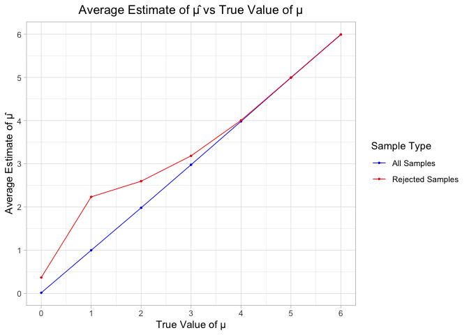
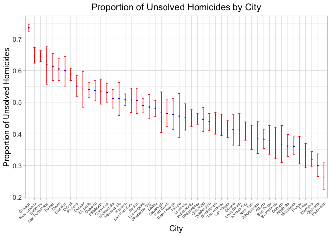

p8105_hw5_ez2384
================

``` r
  library(tidyverse)
  library(dplyr)
  library(tidyr)
  library(ggplot2)
```

### Problem 1

/

### Problem 2

``` r
  n = 30
  sigma = 5
```

``` r
  sim_func = function(sample_size, population_mean, population_std) {
    sim_data = tibble(sample = rnorm(n = sample_size, mean = population_mean, sd = population_std))
    stats  = sim_data %>% summarize(mu_hat = mean(sample))
    t_test = broom::tidy(t.test(sim_data$sample, mu=0)) %>% rename(mu_hat = estimate) %>% select(mu_hat, p.value)
    return(t_test)
  }
```

``` r
  simulation_results =  tibble(mu = 0:6) %>% mutate(data = map(.x=mu, ~ rerun(5000, sim_func(sample_size=n, population_mean=.x, population_std=sigma)) %>% bind_rows()))
```

``` r
  power_results = simulation_results %>% mutate(power = map_dbl(.x=data, ~ mean(.x$p.value < 0.05))) %>% select(mu, power)
  
  ggplot(power_results, aes(x = mu, y = power)) +
    geom_line(size=0.3) +
    geom_point(size=0.5) +
    labs(
      title = "Power of the Test vs. True Value of μ",
      x = "True Value of μ",
      y = "Power (Proportion of Null Rejections)"
    ) +
    theme_light() +
    theme(plot.title = element_text(hjust = 0.5)) +
    scale_x_continuous(breaks = 0:6) +
    scale_y_continuous(breaks = seq(0, 1, by = 0.05))
```

<!-- -->

#### Discussion on plot of true population mean against statistical power

- When μ=0, the power is close to 0.05, which matches the significance
  level (alpha) of 0.05. This is expected because when the null
  hypothesis is true, the probability of rejecting it (Type I error
  rate) is equal to the significance level.  
- As μ moves further away from 0, the power increases steadily. This is
  because as the true mean μ diverges from the null hypothesis mean of
  0, the effect size increases, making it easier for the test to detect
  a significant difference. Consequently, the likelihood of rejecting
  the null hypothesis rises.  
- Asymptotic Power (Power Approaching 1): At higher values of μ (around
  4 to 6), the power approaches 1. This indicates that the test is
  almost always able to detect the difference from the null hypothesis
  when the true mean is substantially different from 0.  
- Conclusion: This plot correctly reflects the association between
  effect size (distance between the true μ and the null hypothesis mean)
  and power as it shows that Small effect sizes result in low power
  whereas larger effect sizes result in higher power. This result
  confirms that the test is more powerful as the effect size increases,

``` r
  average_mu_results =  simulation_results %>% 
                        mutate( avg_mu_hat_all=map_dbl(.x=data, ~ mean(.x$mu_hat)), avg_mu_hat_rejected=map_dbl(data, ~ mean(.x$mu_hat[.x$p.value < 0.05])) ) %>%
                        select( mu, avg_mu_hat_all, avg_mu_hat_rejected )
  
  ggplot(average_mu_results, aes(x = mu)) +
    geom_line(aes(y = avg_mu_hat_all, color = "All Samples"), size = 0.35) +
    geom_point(aes(y = avg_mu_hat_all, color = "All Samples"), size = 0.5) +
    geom_line(aes(y = avg_mu_hat_rejected, color = "Rejected Samples"), size = 0.35) +
    geom_point(aes(y = avg_mu_hat_rejected, color = "Rejected Samples"), size = 0.5) +
    labs(
      title = "Average Estimate of μ̂ vs True Value of μ",
      x = "True Value of μ",
      y = "Average Estimate of μ̂",
      color = "Sample Type"
    ) +
    theme_light() +
    theme(plot.title = element_text(hjust = 0.5)) +
    scale_color_manual(values = c("All Samples" = "blue", "Rejected Samples" = "red")) +
    scale_x_continuous(breaks = 0:6) +
    scale_y_continuous(breaks = 0:6)
```

<!-- -->

#### Discussion on plot of average mu_hat against true mu

- No, the sample average μ_hat across tests for which the null
  hypothesis is rejected is not approximately equal to the true value of
  μ, especially when μ is close to the null hypothesis value (0).
- When μ is close to 0, only samples with sample means μ_hat that are
  far from 0 will produce a p-value below 0.05, leading to rejection of
  the null hypothesis. These extreme values inflate the average of μ_hat
  among the rejected samples.  
- By focusing only on rejected tests, we are selecting samples that
  deviate more from the null hypothesis mean (0), resulting in a higher
  average μ_hat than if we included all samples. This selection bias
  skews the average upwards for the “Rejected Samples” group.

### Problem 3

``` r
  prob3 = read.csv("./homicide-data.csv") %>% mutate( city_state=paste(city, state, sep=", ") )
  total_homicides_per_city=prob3 %>% group_by(city) %>% summarize(total_homicides=n(), unsolved_homicides=sum(disposition == "Closed without arrest" | disposition == "Open/No arrest"))
```

#### Description of Raw Data

- The data included information on a total of 52179 criminal homicides
  over the past decade in 50 of the largest cities within U.S. including
  the killing location, whether arrested, demographic details of each
  victim.

``` r
  prob3_func_1 = function(city_name){
      particular_city = total_homicides_per_city %>% filter(city == city_name)
      prop_test = prop.test(particular_city$unsolved_homicides, particular_city$total_homicides)
      tidy_result = broom::tidy(prop_test)
      df=data_frame(
        point_estimate = tidy_result$estimate[[1]],
        confidence_interval = paste("(", tidy_result$conf.low, ",", tidy_result$conf.high, ")")
      )
      return(df)
  }

  prob3_func_1("Baltimore")
```

    ## # A tibble: 1 × 2
    ##   point_estimate confidence_interval                      
    ##            <dbl> <chr>                                    
    ## 1          0.646 ( 0.627562457662644 , 0.663159860401662 )

``` r
  prob3_func_2 <- function(data) {
    data %>%
      mutate(prop_test = map2(unsolved_homicides, total_homicides, ~ prop.test(.x, .y) %>% broom::tidy())) %>%
      unnest(prop_test) %>%
      select(city, proportion_unsolved = estimate, lower_bound = conf.low, upper_bound = conf.high) %>% 
      mutate(confidence_interval = paste("(", lower_bound, ", ", upper_bound, ")"))
  }
  
  city_results = prob3_func_2(total_homicides_per_city)
  city_results %>% select(-lower_bound, -upper_bound)
```

    ## # A tibble: 50 × 3
    ##    city        proportion_unsolved confidence_interval                       
    ##    <chr>                     <dbl> <chr>                                     
    ##  1 Albuquerque               0.386 ( 0.337260384254284 ,  0.437576606555521 )
    ##  2 Atlanta                   0.383 ( 0.352811897036302 ,  0.414821883953622 )
    ##  3 Baltimore                 0.646 ( 0.627562457662644 ,  0.663159860401662 )
    ##  4 Baton Rouge               0.462 ( 0.414198741860307 ,  0.511023960018796 )
    ##  5 Birmingham                0.434 ( 0.399188948632167 ,  0.468955748189036 )
    ##  6 Boston                    0.505 ( 0.464621930200304 ,  0.545088051772638 )
    ##  7 Buffalo                   0.612 ( 0.568798964634228 ,  0.654087939253532 )
    ##  8 Charlotte                 0.300 ( 0.26608198188312 ,  0.335899860867845 ) 
    ##  9 Chicago                   0.736 ( 0.723995888425454 ,  0.747399787306647 )
    ## 10 Cincinnati                0.445 ( 0.407960574220688 ,  0.483143880618937 )
    ## # ℹ 40 more rows

``` r
  city_results <- city_results %>%
    arrange(desc(proportion_unsolved)) %>%
    mutate(city = factor(city, levels = city))
  
  ggplot(city_results, aes(x = city, y = proportion_unsolved)) +
    geom_point(size = 0.35, color = "blue") +
    geom_errorbar(aes(ymin = lower_bound, ymax = upper_bound), width = 0.35, color = "red") +
    labs(
      title = "Proportion of Unsolved Homicides by City",
      x = "City",
      y = "Proportion of Unsolved Homicides"
    ) +
    theme_light() +
    theme(
      plot.title = element_text(size = 14, hjust = 0.5),
      axis.title.x = element_text(size = 12),
      axis.title.y = element_text(size = 12),
      axis.text.x = element_text(angle = 45, hjust = 1, size = 6),
      axis.text.y = element_text(size = 10)
    )
```

<!-- -->
